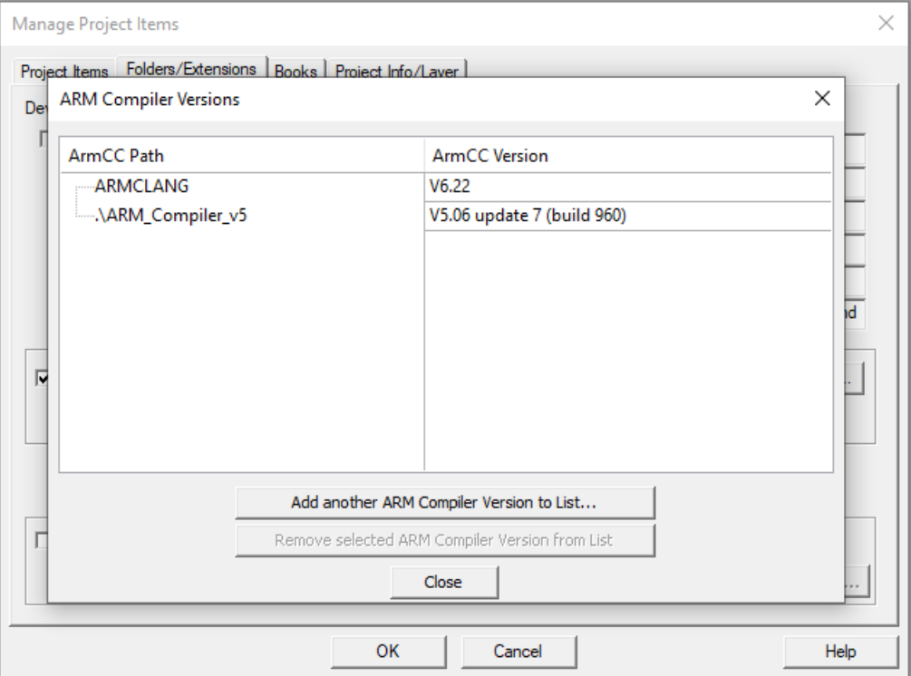

# 电控组入门教程
## 前言
&nbsp;&nbsp;&nbsp;&nbsp;&nbsp;&nbsp;
有关本教程涉及到的资源，部分已上传至本目录。请访问 https://github.com/RM-DragoPass-EC-Group 查询更多信息。部分资源来自Github开源代码，请点击文中链接进入开源项目自行下载。

&nbsp;&nbsp;&nbsp;&nbsp;&nbsp;&nbsp;
DragoPass电控组所有项目管理、版本控制在Github上进行，因此要求成员了解Git和Github的使用。

&nbsp;&nbsp;&nbsp;&nbsp;&nbsp;&nbsp;
受Keil µVision和ST-Link驱动程序的兼容性影响。电控组所有开发在Windows平台上进行，不支持其他操作系统。

&nbsp;&nbsp;&nbsp;&nbsp;&nbsp;&nbsp;
若发现本教程有任何错误，请pull request本目录。如果有任何问题，请优先查找[官方文档](./Docs)，再google，其次询问ChatGPT等。若还有解决不了的问题，请询问其他队员。

## 开发环境配置
### Keil v5 IDE
&nbsp;&nbsp;&nbsp;&nbsp;&nbsp;&nbsp;
[Arm Keil µVision](https://cuhko365-my.sharepoint.com/:f:/g/personal/122090567_link_cuhk_edu_cn/EpD5RNALuEpJrk2PJqFk9OcBj2hMM1zYyE3drTg48dl3eQ?e=bc7DUc) IDE是一个嵌入式领域强大的开发环境，用于Arm Cortex-M基于微控制器的应用程序开发，包括编程、调试和微控制器仿真功能。在电控组开发中作为编译器、烧录器和项目管理器使用。

&nbsp;&nbsp;&nbsp;&nbsp;&nbsp;&nbsp;
运行[mdk540.exe](https://cuhko365-my.sharepoint.com/:f:/g/personal/122090567_link_cuhk_edu_cn/EpD5RNALuEpJrk2PJqFk9OcBj2hMM1zYyE3drTg48dl3eQ?e=bc7DUc)，完成安装过程，请留意安装位置，后续编译器设置需要用到。

&nbsp;&nbsp;&nbsp;&nbsp;&nbsp;&nbsp;
安装成功后，Keil uVision5的Pack Manager会自动运行，如下图所示。每款开发板的处理器、GPIO等参数不同，因此需要配置对应的扩展包。在下文中会详细讲解。

### Keil 注册机
&nbsp;&nbsp;&nbsp;&nbsp;&nbsp;&nbsp;
由于免费版Keil µVision会限制编译工程的总行数，我们需要使用Keil注册机生成密钥激活Keil专业版。安装包和使用教程请见[教程](https://blog.csdn.net/wy1948/article/details/113530260)。注册机安装过程中各种防火墙软件都会报病毒，这个程序本身也十分可疑。我实在不想在本地留这个安装包，就不放onedrive链接了。由于生成的密钥和电脑ID有关，所以需要下载使用。

### CubeMX
&nbsp;&nbsp;&nbsp;&nbsp;&nbsp;&nbsp;
CubeMX是一个图形化的用户界面工具，用于配置STM32微控制器和生成初始化C代码。

&nbsp;&nbsp;&nbsp;&nbsp;&nbsp;&nbsp;
运行[CubeMX.exe](https://cuhko365-my.sharepoint.com/:f:/g/personal/122090567_link_cuhk_edu_cn/EpD5RNALuEpJrk2PJqFk9OcBj2hMM1zYyE3drTg48dl3eQ?e=bc7DUc)，完成安装过程。

&nbsp;&nbsp;&nbsp;&nbsp;&nbsp;&nbsp;
由于当前电控组所有开发都在官方的开发板C上进行，微处理器时序和初始化代码可使用已有框架，暂时不需要使用CubeMX单独配置。但是未来如果使用其他开发板，可能需要使用CubeMX，因此建议了解一下CubeMX的使用。

### VSCode Keil扩展（可选、推荐）
&nbsp;&nbsp;&nbsp;&nbsp;&nbsp;&nbsp;
VSCode请前往微软官网自行安装。

&nbsp;&nbsp;&nbsp;&nbsp;&nbsp;&nbsp;
在VSCode的Extension选项卡中搜索"Keil Assistant"，安装如下扩展：

&nbsp;&nbsp;&nbsp;&nbsp;&nbsp;&nbsp;
安装完成后打开扩展设置： 

&nbsp;&nbsp;&nbsp;&nbsp;&nbsp;&nbsp;
将Keil路径设置为你的Keil安装路径\UV4\UV4.exe（即Keil应用程序位置）（以Keil安装在C:\Keil_v5为例）：

### Copilot（可选、推荐）
&nbsp;&nbsp;&nbsp;&nbsp;&nbsp;&nbsp;
使用学校邮箱注册一个Github账号，尽可能详细真实地填写个人信息（Your Profile）。然后进入教育认证申请链接：
>https://education.github.com/discount_requests/application

&nbsp;&nbsp;&nbsp;&nbsp;&nbsp;&nbsp;
填写信息，等待几天审核。审核完成后下载VSCode的"GitHub Copilot Chat"扩展，登录Github账号后即可使用。

## 第一次编译运行
### 编译器设置
&nbsp;&nbsp;&nbsp;&nbsp;&nbsp;&nbsp;
由于Robomaster多数开源项目基于旧版的FreeRTOS开发，不兼容新版Keil µVision MDK540预装的v6编译器，所以我们需要在IDE中添加v5版本编译器。

&nbsp;&nbsp;&nbsp;&nbsp;&nbsp;&nbsp;
解压[Compiler_v5.zip](https://cuhko365-my.sharepoint.com/:f:/g/personal/122090567_link_cuhk_edu_cn/EpD5RNALuEpJrk2PJqFk9OcBj2hMM1zYyE3drTg48dl3eQ?e=bc7DUc)，运行setup.exe，完成安装过程。建议将编译器安装在Keil安装目录"Keil_v5\ARM\ARM_Compiler_v5"下。以Keil安装在"C:\Keil_v5"为例：
 

### 应用编译器 & 开发板扩展包配置 & 烧录器设置
&nbsp;&nbsp;&nbsp;&nbsp;&nbsp;&nbsp;
接下来我们可以下载大疆Robomaster官方的示例程序进行针对具体工程项目的设置：
>https://github.com/RoboMaster/Development-Board-C-Examples

&nbsp;&nbsp;&nbsp;&nbsp;&nbsp;&nbsp;
[RoboMaster开发板C型嵌入式软件教程文档](https://github.com/RoboMaster/Development-Board-C-Examples/blob/master/RoboMaster%E5%BC%80%E5%8F%91%E6%9D%BFC%E5%9E%8B%E5%B5%8C%E5%85%A5%E5%BC%8F%E8%BD%AF%E4%BB%B6%E6%95%99%E7%A8%8B%E6%96%87%E6%A1%A3.pdf)是RoboMaster官方为开发者编写的教程，涵盖了从环境配置到完整机器人开发的方方面面。虽然内容详细但篇幅很长，如果精力充足可以阅读。

&nbsp;&nbsp;&nbsp;&nbsp;&nbsp;&nbsp;
前往实例程序目录下的 20.standard_robot\MDK-ARM，用Keil µVision打开standard_robot.uvprojx文件，将会出现如下界面：

&nbsp;&nbsp;&nbsp;&nbsp;&nbsp;&nbsp;
安装缺失的开发板扩展包。此过程较为缓慢，请耐心等待。 

&nbsp;&nbsp;&nbsp;&nbsp;&nbsp;&nbsp;
安装完成后，回到Keil IDE界面，点击Manage Project Item，进入项目设置：

&nbsp;&nbsp;&nbsp;&nbsp;&nbsp;&nbsp;
进入Folders/Extensions选项卡：

&nbsp;&nbsp;&nbsp;&nbsp;&nbsp;&nbsp;
点击Use ARM Compiler右侧"..."：

&nbsp;&nbsp;&nbsp;&nbsp;&nbsp;&nbsp;
点击Add another ARM Compiler Version to List...，并导航至v5编译器安装位置（以编译器安装在C:\Keil_v5\ARM\ARM_Compiler_v5为例）：

&nbsp;&nbsp;&nbsp;&nbsp;&nbsp;&nbsp;
添加完成后可以看到ArmCC Version多了一个v5.06：

&nbsp;&nbsp;&nbsp;&nbsp;&nbsp;&nbsp;
回到Keil主页面，进入Option for Target：

&nbsp;&nbsp;&nbsp;&nbsp;&nbsp;&nbsp;
Target目录下这个位置选择v5编译器：

&nbsp;&nbsp;&nbsp;&nbsp;&nbsp;&nbsp;
Debug目录下这个位置选择ST-Link：

&nbsp;&nbsp;&nbsp;&nbsp;&nbsp;&nbsp;
回到Keil主页面，点击Build，开始编译。由于工程较大，首次编译时间较长。后续每次编译只会编译更改部分，5s内即可完成。（旁边还有"Rebuild"按键，可完整编译整个工程）（实测R9 7940HS编译约1min）可以在界面下方Build Output处看到编译进度。

### 烧录至开发板
#### 安装ST-Link烧录器驱动
&nbsp;&nbsp;&nbsp;&nbsp;&nbsp;&nbsp;
解压[ST-Link驱动](https://cuhko365-my.sharepoint.com/:f:/g/personal/122090567_link_cuhk_edu_cn/EpD5RNALuEpJrk2PJqFk9OcBj2hMM1zYyE3drTg48dl3eQ?e=bc7DUc)，运行其中dpinst_amd64.exe程序，完成安装流程，重启电脑。

#### 连接ST-Link
&nbsp;&nbsp;&nbsp;&nbsp;&nbsp;&nbsp;
队里使用的ST-Link烧录器长这个样子：

&nbsp;&nbsp;&nbsp;&nbsp;&nbsp;&nbsp;
前面是USB接口，后面有十根引脚，接口定义均标记在烧录器上。开发板C的SWD下载器使用SWDIO, GND, SWCLK, 3.3V四根。以如下方式通过专用线材连接C板：

&nbsp;&nbsp;&nbsp;&nbsp;&nbsp;&nbsp;
在调试过程中烧录器往往放置在机器人云台上，偶尔因程序bug将烧录器甩飞，导致烧录器损坏，因此队伍中有些烧录器不能正常工作。如果烧录不成功，可以怀疑是烧录器损坏。

#### 烧录
&nbsp;&nbsp;&nbsp;&nbsp;&nbsp;&nbsp;
在项目编译完成后，在Keil界面此处烧录：

### 使用VSCode扩展加载工程、编译、烧录（可选、推荐）
&nbsp;&nbsp;&nbsp;&nbsp;&nbsp;&nbsp;
以20.standard_robot为例，在根目录打开VSCode，在Explorer中打开"KEIL UVISION PROJECT"选项卡,点击右侧"Open keil uVision project"按键。

&nbsp;&nbsp;&nbsp;&nbsp;&nbsp;&nbsp;
进入MDR-ARM目录打开standard_robot.uvprojx,打开选项卡,可以看到项目文件。项目名右侧的三个按键分别是“编译”，“烧录”和“重编译”。功能与Keil IDE中三个功能相同：
